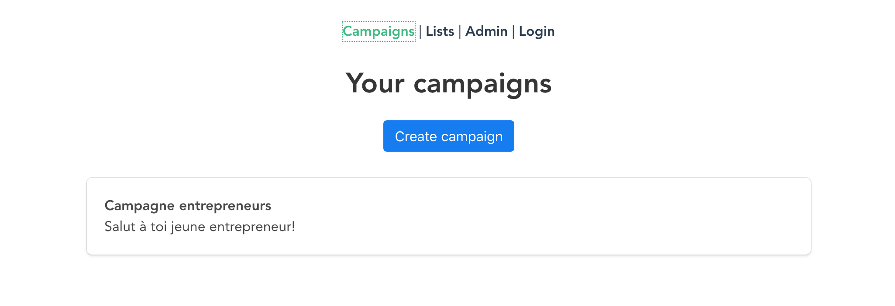
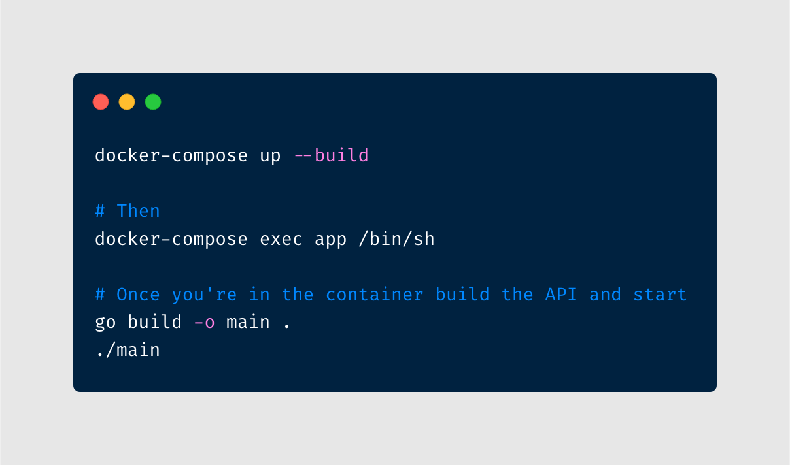

# SpiderMail

A small API emailing solution.



A front end application is available at the following adress : https://github.com/edwinvautier/spidermail-front/

> 💡 It's strongly advised to start the API before the front-end.

---

## Requirements

If you use docker you will only need:
* Docker;
* Docker-Compose;

Refer to [Docker-Setup](#docker-setup) to install with docker.

If not, to run this project, you will need to install the following dependencies on your system:

- [go](https://golang.org/doc/install)

## Docker-Setup



On linux, if you have a permission denied error on mysql_data, run :
```
sudo chown -R <user>:<user> ./mysql_data
```

## Branch naming convention

You branch should have a name that reflects it's purpose.

It should use the same guidelines as [COMMIT_CONVENTIONS](COMMIT_CONVENTIONS.md) (`feat`, `fix`, `build`, `perf`, `docs`), followed by an underscore (`_`) and a very quick summary of the subject in [kebab case][1].

Example: `feat_add-image-tag-database-relation`.

## Pull requests (PR)

Pull requests in this project follow two conventions, you will need to use the templates available in the [ISSUE_TEMPLATE](.github/ISSUE_TEMPLATE) folder :

- Adding a new feature should use the [FEATURE_REQUEST](.github/ISSUE_TEMPLATE/FEATURE_REQUEST.md) template.
- Reporting a bug should use the [BUG_REPORT](.github/ISSUE_TEMPLATE/BUG_REPORT.md) template.

If your pull request is still work in progress, please add "WIP: " (Work In Progress) in front of the title, therefor you inform the maintainers that your work is not done, and we can't merge it.

The naming of the PR should follow the same rules as the [COMMIT_CONVENTIONS](COMMIT_CONVENTIONS.md)

## Git hooks
Git hooks are placed in `.git/hooks`. The only existing hook for now is a pre-commit hook that will run `gofmt -e .` command.

## Linter

We use go linter [gofmt](https://blog.golang.org/gofmt) to automatically formats the source code.

## Contributors

<table>
  <tr>
    <td align="center">
    <a href="https://github.com/jasongauvin">
      
      <br />
      <sub><b>Jason Gauvin</b></sub>
    </a>
    </td>
    <td align="center">
    <a href="https://github.com/JackMaarek/">
      
      <br />
      <sub><b>Jacques Maarek</b></sub>
    </a>
    </td>
    <td align="center">
    <a href="https://github.com/SteakBarbare">
      
      <br />
      <sub><b>Corto Dufour</b></sub>
    </a>
    </td>
    <td align="center">
    <a href="https://github.com/edwinvautier">
      
      <br />
      <sub><b>Edwin Vautier</b></sub>
    </a>
    </td>
  </tr>
</table>
